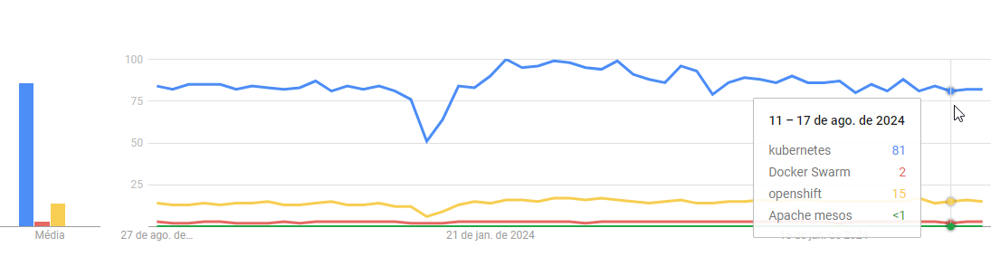
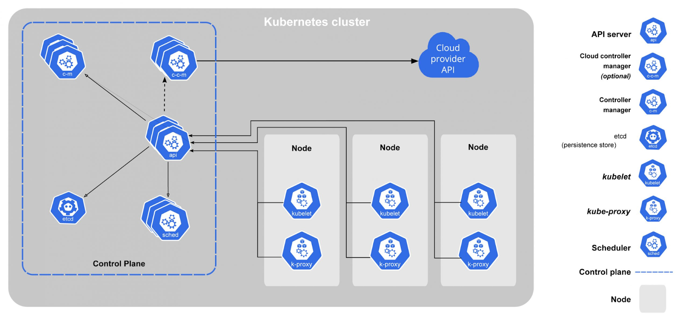
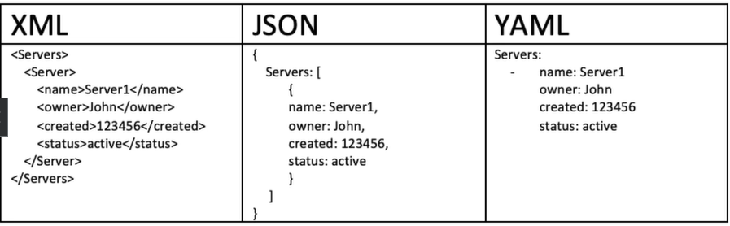
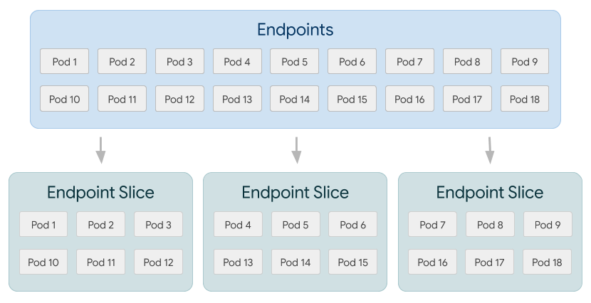

---
tags:
  - Kubernetes
  - Linux
---


# Kubernetes - Conceitos Básicos
> Também chamado de K8s é um orquestrador de containers, ou seja, um sistema que visa a automação do ciclo de vida dos containers, focando em implantação, provisionamento, network, dimensionamento e disponibilidade.

---

## Fundamentos


Assim como o Kubernetes, tem outros orquestradores de containers no mercado, como o Docker Swarm, Red Hat OpenShift e Apache Mesos, entretanto, segundo o Google Trends, o Kubernetes está disparadamente mais popular que qualquer outro orquestrador: 



De nenhuma forma estamos apontando uma superioridade ou inferioridade de qualquer player, apenas estamos identificando a popularidade dos principais players do mercado atualmente.

Para entendermos melhor o Kubernetes, precisamos entender primeiramente alguns princípios:

#### Princípios
- **Imutabilidade**: O *principio da infraestrutura imutável* indica que nunca deve-se realizar ações no sistema em funcionamento, mas sim, preparar um novo container e implementar, dessa forma, ganhando incremento de segurança contra indisponibilidade.
- **Configuração declarativa**: São arquivos para declarar tudo que o Kubernetes irá realizar, evitando *comandos imperativos* (comandos inseridos direto no terminal).
- **Self-Healing System**: O k8s tem opções e configurações para ele mesmo se autorrecuperar de determinadas falhas.
- **Autoscale Up/Down**: Escalabilidade automática conforme demanda, isto é, elasticidade.
- **DevOps Automation Tool**: Automatizar recursos, evitando erros humanos.
- **Fault Protection**: Ações preventivas contra a indisponibilidade.

#### Componentes


- **Control Plane**: É a camada que gerencia os Workers Nodes. Todos os componentes do Control Plane são escaláveis horizontalmente, isto é, aumento de instâncias.
- **API Server**: Servidor de API que está dentro do Control Plane, ele é a ponte que liga o Control Plane com os outros componentes, por exemplo os Workers Nodes.
- **Cloud Controller Manager**: Componente opcional, utilizado para se comunicar especificamente com Nuvens, seja ela qual for, para apresentar seu cluster Kubernetes para a Nuvem.
- **Controller Manager**: Executa os processos de controlador, ou seja, é o cérebro do K8s.
- **etcd**: Banco de dados do tipo chave-valor de código aberto. Gerencia os dados de configuração, estado e metadados, funcionando como apoio para todos os dados do K8s.
- **kube-proxy**: Proxy de rede que roda em cada Work Node do cluster e viabiliza a comunicação de rede com os PODs.
- **POD**: Menor unidade computacional que pode gerenciar. Pods são usados para encapsular um ou mais contêineres que compartilham o mesmo namespace de rede e armazenamento.
- **Schedule**: É o componente que seleciona o node que irá executar determinado PODs, para isso utiliza várias métricas, como cargas de CPU, memória, rede e outros.
- **Kubelet**: É como um fiscal dos containers funcionarem corretamente. Este agente é executado em cada Work Node que garante que os containers são executados dentro do POD correto e os recursos que o container solicita.
- **CRI (Container Runtime Interface)**: O K8s não executa nenhum container propriamente dito, quem na verdade executa o container é o CRI, que é uma interface de abstração que permite que o K8s possa se comunicar com o runtime de containers de baixo nível. Com essa técnologia o K8s ganha compatibilidade com alguns runtimes do mercado, como o container-d, CRI-O, docker e outros. 

#### YAML
É uma linguagem de serialização de dados projetada para ser legível para humanos e simples, se tornando facil de usar quando precisamos definir configurações em arquivos.

**Características**

- Não é uma linguagem de marcação, como por exemplo o HTML.
- É uma linguagem de serialização de dados.
- É case-sensitive
- Utiliza UTF-8 ou UTF-16
- Utiliza as extenções yml ou yaml



## Recursos
Nessa etapa estaremos identificando diversos recursos do K8s e fornecendo comandos e parâmetros de uso. Os comandos serão apresentados com o nome do recurso, cabe na hora que for utiliza-los, identificar o que precisa ser alterado no comando para corresponder ao seu ambiente.

#### Pods
É a menor unidade implantável e gerenciável. Ele é um grupo de um ou mais contêineres (como os containers Docker), que são executados em um único nó. Esses contêineres dentro de um pod compartilham os mesmos recursos, incluindo o sistema de arquivos, endereço IP, e as portas de rede.

**Principais parâmetros:**

- spec.containers

**Arquivo YAML de exemplo:**
```yaml
apiVersion: v1
kind: Pod
metadata:
  name: exemplo-pod
  labels:
    app: exemplo
spec:
  containers:
    - name: nginx-container
      image: nginx:latest
      ports:
        - containerPort: 80
```

**Principais comandos:**
```shell
kubectl get pods
kubectl get pods --all-namespaces
kubectl run my-pod-apache-server --image httpd
kubectl get pods -o wide
kubectl delete pods my-pod-apache-server
kubectl delete --all pods
kubectl create -f my-pod.yaml
kubectl delete -f my-pod.yaml
```
#### ReplicaSets
Um ReplicaSet é um controlador cujo principal objetivo é garantir que um número especificado de réplicas de um pod esteja em execução a qualquer momento. Ele assegura que um conjunto de pods idênticos esteja disponível e pronto para atender às demandas de carga da aplicação, proporcionando alta disponibilidade e escalabilidade.

**Principais parâmetros**

- spec.replicas
- spec.selector
- spec.template

**Arquivo YAML de exemplo**

```yaml
apiVersion: apps/v1
kind: ReplicaSet
metadata:
  name: my-replicaset
  labels:
    app: my-app
spec:
  replicas: 3
  selector:
    matchLabels:
      app: my-app
  template:
    metadata:
      labels:
        app: my-app
    spec:
      containers:
      - name: my-container
        image: my-image:latest
        ports:
        - containerPort: 80

```

**Principais comandos**

```Shell
kubectl get replicaset
kubectl create -f my-replicaset.yaml
kubectl delete pods frontend-rs-82cm5  # Como é um replica set, o pod será recriado automaticamente
kubectl scale replicaset frontend-rs --replicas=5 && watch kubectl get pods
kubectl delete replicaset frontend-rs
```
#### Deployments
Deployment é um recurso de nível superior que fornece uma forma declarativa de gerenciar pods e ReplicaSets. Ele permite a implantação de aplicações, automação de atualizações, a reversão em caso de falhas, o escalonamento de aplicações e a manutenção da saúde dos pods.

**Principais parâmetros**

- spec.replicas
- spec.selector
- spec.template

**Arquivo YAML de exemplo**

```yaml
apiVersion: apps/v1
kind: Deployment
metadata:
  name: frontend
spec:
  replicas: 3
  selector:
    matchLabels:
      app: myapp
      tier: frontend
  template:
    metadata:
      labels:
        app: myapp
        tier: frontend
    spec:
      containers:
      - name: frontend
        image: nginx:1.14.2
        ports:
        - containerPort: 80
```

**Principais comandos**

```Shell
kubectl apply -f my-deployment.yaml
kubectl get deployments -o wide
kubectl get all
kubectl rollout status deployment.apps/frontend-deployment
kubectl describe deployment.apps/frontend-deployment
kubectl delete deployment frontend-deployment
kubectl rollout history deployment.apps/frontend-deployment
kubectl rollout history deployment.apps/frontend-deployment --revision=2
kubectl rollout undo deployment.apps/frontend-deployment
kubectl rollout undo deployment.apps/frontend-deployment --to-revisio
kubectl rollout pause deployment.apps/frontend-deployment
kubectl rollout resume deployment.apps/frontend-deployment
kubectl scale deployment.apps/frontend-deployment --replicas=2
kubectl describe deployment.apps/frontend-deployment | grep StrategyType

```
#### Services
Os Services em Kubernetes são um tipo de recurso que proporciona uma forma de expor uma aplicação rodando em um conjunto de Pods como um serviço de rede. Eles permitem a comunicação estável e confiável entre diferentes partes de uma aplicação e entre aplicações, abstraindo a volatilidade dos Pods que podem ser criados e destruídos dinamicamente. Tendo como tipos:

- ClusterIP (Padrão)
- NodePort
- LoadBalancer
- ExternalName

**Principais parâmetros**

- spec.selector
- spec.ports
- spec.type

**Arquivo YAML de exemplo**
```yaml
apiVersion: v1
kind: Service
metadata:
  name: my-service
  namespace: default
  labels:
    app: my-app
spec:
  selector:
    app: my-app
  ports:
    - protocol: TCP
      port: 80
      targetPort: 8080
  type: ClusterIP
```

**Principais comandos**

```shell
kubectl create -f service.yaml
kubectl get services
kubectl get svc --all-namespaces -o wide
kubectl describe service my-service
kubectl delete service my-service

```
#### Liveness Probes
Liveness Probes são verificações de saúde usadas para determinar se um contêiner em um pod está funcionando corretamente. Se a verificação de liveness falhar, o contêiner é considerado inativo ou com problema, e o Kubernetes irá reiniciá-lo automaticamente para tentar recuperar a aplicação. Tendo como tipos:

- HTTP Probe
- TCP Probe
- Exec Probe

**Principais parâmetros**

- spec.containers.livenessProbe.httpGet
- spec.containers.livenessProbe.initialDelaySeconds
- spec.containers.livenessProbe.periodSeconds
- spec.containers.livenessProbe.timeoutSeconds
- spec.containers.livenessProbe.failureThreshold

**Arquivo YAML de exemplo**
```yaml
apiVersion: v1
kind: Pod
metadata:
  name: my-pod
spec:
  containers:
    - name: my-container
      image: my-image:latest
      livenessProbe:
        httpGet:
          path: /healthz
          port: 8080
        initialDelaySeconds: 30
        periodSeconds: 10
        timeoutSeconds: 5
        failureThreshold: 3
```
**Principais comandos**

```shell
kubectl apply -f pod.yaml
kubectl describe pod my-pod
kubectl logs my-pod --previous

```
#### Volumes
Volumes em Kubernetes são recursos de armazenamento utilizados pelos pods para persistir dados além do ciclo de vida dos contêineres. A abordagem de volumes em Kubernetes resolve a limitação dos contêineres Docker, que perdem seus dados ao serem reiniciados.
Em Kubernetes, um volume é um diretório acessível para um ou mais contêineres em um pod, que pode armazenar dados de forma persistente. Volumes podem ter diferentes backends de armazenamento, como sistemas de arquivos locais, NFS, armazenamento em nuvem, etc.

Tipos:

- emptyDir
- hostPath
- nfs
- persistentVolumeClain (PVC)
- configMap e secret
- Storage Classes
- volumeMounts

**Principais parâmetros**

- spec.containers.volumeMounts
- spec.volumes

**Arquivo YAML de exemplo**
```yaml
apiVersion: v1
kind: Pod
metadata:
  name: my-pod
spec:
  containers:
    - name: my-container
      image: my-image:latest
      volumeMounts:
        - name: my-emptydir
          mountPath: /mnt/emptydir
        - name: my-hostpath
          mountPath: /mnt/hostpath
        - name: my-configmap
          mountPath: /mnt/configmap
          readOnly: true
        - name: my-secret
          mountPath: /mnt/secret
          readOnly: true
  volumes:
    - name: my-emptydir
      emptyDir: {}
    - name: my-hostpath
      hostPath:
        path: /data/hostpath
        type: Directory
    - name: my-configmap
      configMap:
        name: my-configmap
    - name: my-secret
      secret:
        secretName: my-secret

```
**Principais comandos**

```shell
kubectl apply -f pod.yaml
watch kubectl get pods
kubectl get pv  # Para PersistentVolumes
kubectl get pvc # Para PersistentVolumeClaims
kubectl describe pod <nome-do-pod>
kubectl describe pv <nome-do-pv>
kubectl get pods
```
#### DeamonSets
DaemonSet é um tipo de recurso que garante que uma cópia de um pod seja executada em cada nó do cluster. Em outras palavras, ele assegura que todos os nós, ou um subconjunto específico de nós, tenham uma instância de um determinado pod rodando. 
Você pode usar nodeSelectors, affinity e tolerations para restringir em quais nós o DaemonSet deve ser executado.

**Principais parâmetros**

- spec.selector.matchLabels.app
- spec.template.metadata
- spec.template.spec

**Arquivo YAML de exemplo**
```yaml
apiVersion: apps/v1
kind: DaemonSet
metadata:
  name: my-daemonset
  namespace: default
  labels:
    app: my-app
spec:
  selector:
    matchLabels:
      app: my-app
  template:
    metadata:
      labels:
        app: my-app
    spec:
      containers:
        - name: my-container
          image: my-image:latest
          ports:
            - containerPort: 80
```
**Principais comandos**

```shell
kubectl apply -f daemonset.yaml
kubectl get daemonsets
kubectl get ds
kubectl describe daemonset <nome-do-daemonset>
kubectl delete daemonset <nome-do-daemonset>
kubectl get ds/my-daemonset -o go-template='{{.spec.updateStrategy.type}}{{"\n"}}' -n default
kubectl get ds/my-daemonset -o go-template='{{.spec.updateStrategy.rollingUpdate.maxUnavailable}}{{"\n"}}' -n default
```
#### Jobs
Um "Job" é um tipo de recurso que gerencia a execução de tarefas ou trabalhos que precisam ser completados uma ou mais vezes. É particularmente útil para tarefas que não precisam rodar continuamente, mas sim até que sejam concluídas com sucesso.

- Objetivo: O objetivo principal de um Job é garantir que uma ou mais tarefas sejam concluídas. Isso é diferente de um "Pod", que pode ser usado para processos contínuos.
- Repetição: Um Job pode criar um ou mais Pods para executar uma tarefa. Ele garante que o número especificado de Pods complete sua execução com sucesso. Caso um Pod falhe, o Job pode criar novos Pods para tentar novamente até que a tarefa seja completada com sucesso.
- Completamento: Você pode configurar o Job para que ele complete quando um certo número de Pods tiverem terminado a execução com sucesso. Isso é definido pela configuração de completions no Job. Por exemplo, se você configurar completions: 5, o Job considerará concluído quando cinco Pods tiverem sido executados com sucesso.
- Retry e Paralelismo: Jobs podem ser configurados para ter múltiplas execuções paralelas (parallelism) e podem tentar novamente se falharem (backoffLimit).
Monitoramento: Você pode monitorar o progresso e o estado dos Jobs usando comandos do kubectl, como `kubectl get jobs`, `kubectl describe job <job-name>` e `kubectl describe pods <job-name> | grep Exit`.

Container Exit Codes:

| Código | Mensagem | Resumo |
| ------ | -------- | ------ |
| 1 | Applicantion error | Erro genérico ou falha na aplicação. |
| 126 | Command invoke error | O comando não pode ser invocado ou executado, muitas vezes por falta de permissões. |
| 127 | File or directory not found | O comando não foi encontrado. Pode indicar que o arquivo ou diretório não existe. |
| 134 | Abnormal termination | O processo terminou de forma anormal, frequentemente devido a um sinal de término. |
| 137 | Immediate termination | O processo foi terminado imediatamente pelo sinal SIGKILL (kill -9). |
| 139 | Segmentation fault | O processo encontrou um erro de segmentação, que é um tipo de falha de acesso à memória. |
| 255 | Exit Status Out of Range | O código de saída está fora do intervalo permitido, geralmente indicando um erro ou comportamento inesperado. |
| 0 | Purposely stopped | O processo foi terminado com sucesso e sem erros. |

Container Restart Policy:

Define como o Kubernetes deve lidar com a reinicialização dos containers quando eles falham ou são encerrados.

- Always 🠪 Reinicia o container sempre, útil para serviços contínuos.
- OnFailure 🠪 Reinicia o container apenas se houver falha, ideal para Jobs e tarefas.
- Never 🠪 Não reinicia o container, útil para containers que devem executar uma tarefa e sair.

**Principais parâmetros**

- spec.completions
- spec.parallelism
- spec.backoffLimit
- spec.template.spec

**Arquivo YAML de exemplo**
```yaml
apiVersion: batch/v1
kind: Job
metadata:
  name: my-job
  namespace: default
spec:
  completions: 3
  parallelism: 1
  backoffLimit: 4
  template:
    metadata:
      labels:
        app: my-app
    spec:
      containers:
        - name: my-container
          image: my-image:latest
          command: ["sh", "-c", "echo Hello, Kubernetes! && sleep 30"]
      restartPolicy: Never
```
**Principais comandos**

```shell
kubectl apply -f job.yaml
kubectl get jobs
kubectl get job <nome-do-job> --output yaml | grep type
kubectl get job <nome-do-job> --output yaml | grep reason
kubectl describe job <nome-do-job>
kubectl describe pods <nome-do-job> | grep Status:
kubectl describe pods <nome-do-job> | grep Exit
kubectl logs <nome-do-pod>
kubectl delete job <nome-do-job>

```
#### CronJobs
É um recurso que permite agendar a execução de Jobs em horários específicos, semelhante ao cron no Linux. É uma maneira poderosa de automatizar tarefas que precisam ser realizadas periodicamente.


CronJob Special Strings:

| Entry | Equivalence |
| ----- | ----------- |
| @yearly, @annually | 0 0 1 1 * |
| @monthly | 0 0 1 * * |
| @weekly | 0 0 * * 0 |
| @daily, @midnight | 0 0 * * * |
| @hourly | 0 * * * * |

Links de auxílio:

- <a href="https://crontab.guru/" target="_blank">Cronjob Schedule Editor Online</a>.

**Principais parâmetros**

- spec.jobTemplate
- spec.successfulJobsHistoryLimit
- spec.failedJobsHistoryLimit
- spec.startingDeadlineSeconds
- spec.concurrencyPolicy

**Arquivo YAML de exemplo**
```yaml
apiVersion: batch/v1
kind: CronJob
metadata:
  name: my-cronjob
  namespace: default
  labels:
    app: my-app
spec:
  schedule: "0 2 * * *"  # Executa todos os dias às 2 da manhã
  jobTemplate:
    metadata:
      labels:
        app: my-app
    spec:
      template:
        metadata:
          labels:
            app: my-app
        spec:
          containers:
            - name: my-container
              image: my-image:latest
              command: ["sh", "-c", "echo 'Hello, Kubernetes!'"]
          restartPolicy: OnFailure
  successfulJobsHistoryLimit: 3
  failedJobsHistoryLimit: 1
  startingDeadlineSeconds: 600
  concurrencyPolicy: Forbid
```
**Principais comandos**

```shell
kubectl apply -f cronjob.yaml
kubectl get cronjobs
kubectl describe cronjob <nome-do-cronjob>
kubectl patch cj my-cj -p '{"spec" : {"suspend":true}}'
kubectl get jobs --selector=job-name=<nome-do-cronjob>
kubectl delete cronjob <nome-do-cronjob>

```
#### ConfigMaps
Um ConfigMap é um recurso usado para armazenar dados de configuração em formato chave-valor. Esses dados podem ser utilizados para configurar aplicações que estão sendo executadas em um cluster Kubernetes.
Podemos inserir essas configurações de duas forma:

- Injetado: Utilizado somente o parâmetro *envFrom* fazendo assim que as configurações sejam importadas como variáveis de ambiente dentro do Pod. Para alterá-las é preciso redeployar o Pod, ou seja, excluir e criar novamente. Vide parâmetro *envFrom* abaixo:
??? note "Exemplo - ConfigMaps Injetado"
    ```yaml
    apiVersion: v1
    kind: ConfigMap
    metadata:
        name: my-cm
    namespace: default
    data:
        database: mysql
        database_uri: mysql://localhost:3306
    ---
    kind: Pod
    apiVersion: v1
    metadata:
        name: pod-cm-env
    spec:
        containers:
        - name: my-container
          image: nginx
          envFrom:
            - configMapRef: 
              name: my-cm
    ```
- Montado: Dessa forma é utilizado de volumes para montar cada entrada de chave-valor do ConfigMap para ser um arquivo dentro do Pod. Dessa forma, quando alteramos o ConfigMap o arquivo é atualizado automaticamente (Pode levar 2 minutos). Todavia, caso juntamente esteja injetando nas variáveis de ambiente, o arquivo montado estará atualizado mas as variáveis de ambiente necessitam que o Pod seja reiniciado para reler os arquivos e atualizar as variáveis. Vide parâmetro *volumeMounts* e *volumes* abaixo:
??? note "Exemplo - ConfigMaps Montado"
    ```yaml
    kind: ConfigMap
    apiVersion: v1
    metadata:
      name: my-cm
      namespace: default
    data:
      database: mariadb
      database_uri: mariadb://localhost:3306
    --- 
    kind: Pod
    apiVersion: v1
    metadata:
        name: pod-cm-vol
    spec:
        containers:
        - name: my-container
          image: nginx
          volumeMounts:
            - name: my-vol
              mountPath: "/etc/my-vol"
              readOnly: true
        
    volumes:
        - name: my-vol
          configMap:
            name: my-cm
    ```
É possível utilizar os dois tipos de inserção de configurações simultaneamente. Vide parâmetro “envFrom”, “volumeMounts” e “volumes”:
??? note "Exemplo - ConfigMaps Injetado e Montado"
    ```yaml
    spec:
        containers:
        - name: my-container
            image: nginx
            envFrom:
              - configMapRef: 
                name: my-cm
            volumeMounts:
              - name: my-vol
                mountPath: "/etc/my-vol"
                readOnly: true
        
    volumes:
    - name: my-vol
      configMap:
        name: my-cm
    ```

Podemos também inserir vários parâmetros em um arquivo apenas no container, para isso, no ConfigMap precisa ser definido como abaixo. Dessa forma, será mapeado apenas um arquivo chamado my.config.db no Pod:
??? note "Exemplo - Vários parâmetros"
    ```yaml
    data:
    #Connection database-config
    my.config.db: |
        database: mariadb
        database_uri: mariadb://localhost:3306
    ```

**Principais parâmetros**

- spec.containers.volumeMounts
- volumes.configMap
- data
- binaryData

**Arquivo YAML de exemplo**
```yaml
apiVersion: v1
kind: ConfigMap
metadata:
  name: example-configmap
  namespace: default  # Se não especificado, assume o namespace padrão
data:
  # Armazenamento de dados de configuração como pares chave-valor
  key1: "value1"
  key2: "value2"
  # Armazenamento de dados de configuração em múltiplas linhas
  multiline-key: |
    Linha 1
    Linha 2
    Linha 3
binaryData:
  # Armazenamento de dados binários codificados em base64
  binary-key: "dGVzdGJpbmFyeWRhdGE="  # "testbinarydata" codificado em base64
```
**Principais comandos**

```shell
kubectl create configmap <nome-do-configmap> --from-file=<caminho-do-arquivo>
kubectl create configmap <nome-do-configmap> --from-literal=<chave>=<valor>
kubectl get configmaps
kubectl describe configmap <nome-do-configmap>
kubectl describe pod <nome-do-pod> | grep Warning
kubectl get events | grep Warning
kubectl apply -f <caminho-do-arquivo-yaml>
kubectl delete configmap <nome-do-configmap>

```
#### Secrets
"Secret" é um recurso usado para armazenar dados sensíveis, como senhas, chaves SSH, tokens de API, e certificados. A ideia é que você possa gerenciar essas informações de forma segura e acessível para suas aplicações em execução.

*Armazenamento Seguro*

Os Secrets são armazenados em base64 no etcd, o banco de dados do Kubernetes. Isso não é criptografia, mas um método simples de codificação que evita a exposição de dados sensíveis em texto claro. 
Em clusters Kubernetes configurados adequadamente, os dados dos Secrets são criptografados no etcd, o que adiciona uma camada extra de segurança.

*Criação e gestão*

Pode criar um Scret usando arquivos YAML ou JSON, ou diretamente via kubectl. Um Secret pode ter diferentes tipos, como `Opaque` (O tipo mais genérico), `docker-registry` (para credenciais de registro Docker) ou `basic-auth` (para autenticação básica HTTP).
É importante que os Secrets sejam manipulados com cuidado. Evite colocá-los diretamente em arquivos de configuração que possam ser versionados no controle de versão ou expostos inadvertidamente.

*Uso em pods*

Pode montar um Secret como um volume em um pod. Isso é útil quando você precisa que as aplicações leiam arquivos de configuração sensíveis.
??? note "Exemplo"
    ```yaml
    apiVersion: v1
    kind: Pod
    metadata:
        name: my-pod
    spec:
        containers:
        - name: my-container
        image: my-image
        volumeMounts:
        - name: secret-volume
            mountPath: /etc/secret
        volumes:
        - name: secret-volume
        secret:
            secretName: my-secret
    ```

Você também pode expor Secrets como variáveis de ambiente no container, o que é útil para configuração de aplicações.
??? note "Exemplo"
    ```yaml
    apiVersion: v1
    kind: Pod
    metadata:
      name: my-pod
    spec:
      containers:
      - name: my-container
        image: my-image
        env:
        - name: DB_USERNAME
          valueFrom:
            secretKeyRef:
              name: my-secret
              key: username
        - name: DB_PASSWORD
          valueFrom:
            secretKeyRef:
              name: my-secret
              key: password
    ```

*Boas Práticas*

Restrinja o acesso aos Secrets usando RBAC (Controle de Acesso Baseado em Função). Somente os serviços e pods que realmente precisam desses Secrets devem ter acesso.
Para maior segurança, considere usar soluções externas de gerenciamento de segredos, como `HashiCorp Vault` ou `AWS Secrets Manager`, especialmente em ambientes de produção.

*Built-In Type*

O termo "bultin type" se refere a tipos de dados integrados e pré-definidos que você pode usar para criar e gerenciar Secrets.

- Opaque 🠪 Tipo padrão. Permite armazenar dados arbitrários de chave-valor. type: Opaque
- docker-registry 🠪 Armazenar credenciais para acesso ao registries privados do Docker. type: kubernetes.io/dockerconfigjson
- basic-auth 🠪 Armazenar credenciais de autenticação básica sendo o segredo codificado em base64. type: kubernetes.io/basic-auth
- ssh-auth 🠪 Armazenar chaves ssh. type: kubernetes.io/ssh-auth
- TLS 🠪 Armazenar certificados e chaves type: kubernetes.io/tls
- service-account-token 🠪 Usado internamente pelo kubernetes para gerenciar tokens de serviço.

*data e stringData*

São campos usados para armazenar os dados de um Secret, mas eles têm diferenças importantes em como você deve usá-los e como os dados são manipulados.
O campo data é usado para armazenar dados binários codificados em Base64. Isso significa que você precisa codificar manualmente os valores dos campos em Base64 antes de inseri-los no YAML do Secret.
??? note "Exemplo"
    ```yaml
    apiVersion: v1
    kind: Secret
    metadata:
      name: basic-auth-secret
    type: kubernetes.io/basic-auth
    data:
      username: dXNlcg==       # "user" em Base64
      password: cGFzc3dvcmQ=   # "password" em Base64
    ```
O campo stringData é usado para fornecer dados em formato de string simples, sem a necessidade de codificação Base64. O Kubernetes irá automaticamente codificar os dados em Base64 quando o Secret for criado ou atualizado.
??? note "Exemplo"
    ```yaml
    apiVersion: v1
    kind: Secret
    metadata:
      name: basic-auth-secret
    type: kubernetes.io/basic-auth
    stringData:
      username: user       # "user", não codificado
      password: password   # "password", não codificado
    ```

**Principais parâmetros**

- data.username
- data.password
- stringData.api-key

**Arquivo YAML de exemplo**
```yaml
apiVersion: v1
kind: Secret
metadata:
  name: example-secret
  namespace: default  # Se não especificado, assume o namespace padrão
type: Opaque
data:
  username: dXNlcg==  # "user" codificado em base64
  password: cGFzc3dvcmQ=  # "password" codificado em base64
stringData:
  api-key: my-secret-api-key  # "my-secret-api-key" será convertido para base64 automaticamente
```
**Principais comandos**

```shell
echo -n 'valor' | base64  # Codificar um valor em base64
kubectl create secret generic <nome-do-secret> --from-file=<caminho-do-arquivo>
kubectl create secret generic <nome-do-secret> --from-literal=<chave>=<valor>
kubectl create secret generic <nome-do-secret> --from-file=<caminho-do-diretorio>
kubectl get secrets
kubectl describe secret <nome-do-secret>
kubectl apply -f <caminho-do-arquivo-yaml>
kubectl delete secret <nome-do-secret>

```
#### StatefulSets
É um recurso do Kubernetes projetado para gerenciar aplicações com estado, que exigem persistência e identificação única para cada instância de Pod. Ele é ideal para casos onde você precisa garantir que cada Pod tenha um identificador estável e armazenamento persistente, como em bancos de dados e outras aplicações que precisam de gerenciamento de estado.

*Características Principais do StatefulSet*

1. Identidade Estável 🠪 Cada Pod em um StatefulSet recebe um nome único e previsível que não muda durante a vida útil do Pod. Esse nome é composto pelo nome do StatefulSet e um índice ordinal (por exemplo, myapp-0, myapp-1, etc.). Isso garante que cada Pod possa ser referenciado de forma consistente.
2. Armazenamento Persistente 🠪  O StatefulSet pode ser configurado para usar Volumes Persistentes (Persistent Volumes - PVs) e Claims (Persistent Volume Claims - PVCs). Cada Pod recebe um Volume Persistente associado a ele que persiste mesmo se o Pod for recriado ou movido para outro nó. Isso é essencial para aplicações que armazenam dados locais que precisam ser preservados.
3. Orquestração e Escalonamento 🠪 O StatefulSet garante uma ordem específica de criação e exclusão de Pods. Os Pods são criados e excluídos de forma sequencial, o que é importante para garantir a ordem e a estabilidade durante o escalonamento e atualizações.
4. Acesso a Dados e Configuração 🠪 Os Pods em um StatefulSet podem usar ConfigMaps e Secrets para configurar dados específicos de cada instância. A identidade estável e o armazenamento persistente ajudam a garantir que cada Pod mantenha seu estado e configuração individual.

*Componentes do StatefulSet*

- serviceName
- replicas
- selector
- template
- volumeClaimTemplates

*Casos de Uso Comuns*

- Banco de dados
- Caches distribuídos
- Aplicações que Requerem Identidade Estável


**Principais parâmetros**

- spec.serviceName
- spec.replicas
- spec.selector
- spec.template
- spec.volumeClaimTemplates

**Arquivo YAML de exemplo**
```yaml
apiVersion: apps/v1
kind: StatefulSet
metadata:
  name: example-statefulset
  namespace: default  # Se não especificado, assume o namespace padrão
spec:
  serviceName: "example-service"  # Nome do serviço associado ao StatefulSet
  replicas: 3  # Número de réplicas desejado
  selector:
    matchLabels:
      app: example
  template:
    metadata:
      labels:
        app: example
    spec:
      containers:
      - name: example-container
        image: nginx:latest
        ports:
        - containerPort: 80
          name: http
        volumeMounts:
        - name: example-storage
          mountPath: /usr/share/nginx/html
  volumeClaimTemplates:
  - metadata:
      name: example-storage
    spec:
      accessModes: ["ReadWriteOnce"]
      resources:
        requests:
          storage: 1Gi
```
**Principais comandos**

```shell
kubectl apply -f <caminho-do-arquivo-yaml>
kubectl get statefulsets
kubectl describe statefulset <nome-do-statefulset>
kubectl scale statefulset <nome-do-statefulset> --replicas=<número-de-réplicas>
kubectl get persistentvolumeclaim
kubectl patch pv <nome-do-pvc> -p '{"spec": {"persistentVolumeReclaimPolicy":"Retain"}}'
sudo updatedb && sudo locate <nome-do-pvc>
kubectl delete statefulset <nome-do-statefulset>

```
#### Endpoints

Um endpoint é uma lista de IPs e portas que são associados a um serviço. O Kubernetes usa endpoints para descobrir e se conectar aos pods que pertencem a um serviço. Quando você cria um serviço, o Kubernetes automaticamente cria um objeto Endpoints que inclui as informações sobre os pods que correspondem ao serviço.
!!! quote "Nota"
    O Endpoint e o Service devem ter o mesmo nome para que o Kubernetes automaticamente vincule esses dois recursos.

*Como Funciona*

1. Quando você cria um serviço no Kubernetes, o controlador de serviço busca todos os pods que correspondem aos seletores definidos no serviço.
2. O controlador de endpoints então cria um objeto Endpoints que contém informações sobre esses pods, incluindo seus IPs e portas.
3. Esse objeto Endpoints é atualizado dinamicamente sempre que há alterações nos pods que correspondem ao serviço.

*Visão Geral*

- Objetivo: O objetivo principal dos endpoints é fornecer uma maneira para o serviço saber quais pods estão disponíveis e onde eles estão.
- Atualizações Dinâmicas: Eles são atualizados automaticamente pelo Kubernetes conforme os pods são criados ou destruídos, garantindo que o serviço sempre tenha informações precisas sobre como alcançar os pods correspondentes.

**Principais parâmetros**

- subsets.addresses
- subsets.ports

**Arquivo YAML de exemplo**
```yaml
apiVersion: v1
kind: Endpoints
metadata:
  name: example-endpoints
  namespace: default  # Se não especificado, assume o namespace padrão
subsets:
  - addresses:
    - ip: 10.0.0.1
    - ip: 10.0.0.2
    ports:
    - name: http
      port: 80
      protocol: TCP
```
**Principais comandos**

```shell
kubectl get endpoints
kubectl describe endpoints <nome-do-endpoints>
kubectl apply -f <caminho-do-arquivo-yaml>
kubectl delete endpoints <nome-do-endpoints>

```
#### EndpointSlice
Nos clusters Kubernetes grandes, onde há um grande número de pods e serviços, o recurso Endpoints pode se tornar um gargalo em termos de desempenho. O objeto Endpoints armazena todos os IPs e portas dos pods correspondentes a um serviço em um único recurso, o que pode levar a problemas de desempenho e escalabilidade.
EndpointSlice é uma API que foi introduzida para resolver esses problemas. Ele divide a lista de endpoints em vários objetos menores, chamados "slices", que são mais fáceis de gerenciar e mais eficientes para o cluster



**Principais parâmetros**

**Arquivo YAML de exemplo**
```yaml
apiVersion: discovery.k8s.io/v1
kind: EndpointSlice
metadata:
  name: example-endpointslice
  namespace: default  # Se não especificado, assume o namespace padrão
  labels:
    kubernetes.io/service-name: example-service
addressType: IPv4
endpoints:
  - addresses:
    - 10.0.0.1
    - 10.0.0.2
    ports:
    - name: http
      port: 80
      protocol: TCP
  - addresses:
    - 10.0.0.3
    ports:
    - name: http
      port: 80
      protocol: TCP
```
**Principais comandos**

```shell
kubectl get endpointslices
kubectl describe endpointslice <nome-do-endpointslice>
kubectl apply -f <caminho-do-arquivo-yaml>
kubectl delete endpointslice <nome-do-endpointslice>

```
#### RBAC
RBAC (Role-Based Access Control) é um mecanismo de controle de acesso utilizado no Kubernetes para gerenciar permissões e autorizações dentro de um cluster. Ele permite que você defina e controle quais ações os usuários e aplicações podem realizar em recursos do Kubernetes, como pods, serviços e namespaces.

*Conceitos Básicos*

1. Roles (Papéis):
    - Um Role define um conjunto de permissões dentro de um namespace específico. Essas permissões especificam quais ações podem ser realizadas em quais recursos. Por exemplo, um Role pode permitir listar e obter pods em um namespace específico.
    - ClusterRole é similar a um Role, mas suas permissões se aplicam a todo o cluster, não apenas a um namespace.
2. RoleBindings e ClusterRoleBindings:
    - Um RoleBinding associa um Role a um usuário ou grupo de usuários dentro de um namespace específico. Isso concede as permissões definidas pelo Role aos usuários ou grupos especificados.
    - Um ClusterRoleBinding faz algo semelhante, mas associa um ClusterRole a um usuário ou grupo em todo o cluster, não apenas em um namespace.
3. Subjects:
    - Em RoleBindings e ClusterRoleBindings, os subjects podem ser usuários, grupos, ou contas de serviço (Service Accounts). Eles são as entidades que recebem as permissões definidas pelos roles.
4. Rules (Regras):
    - Dentro de um Role ou ClusterRole, as regras definem os recursos e as ações permitidas. Por exemplo, uma regra pode permitir a ação de get, list, e watch em pods.
    - get, list, watch, create, update, patch, delete, deletecollection, approve, bind


**Principais parâmetros**

- rules
- roleRef

**Arquivo YAML de exemplo**

*Exemplo de Role*

```yaml
apiVersion: rbac.authorization.k8s.io/v1
kind: Role
metadata:
  name: example-role
  namespace: default
rules:
  - apiGroups: [""]
    resources: ["pods"]
    verbs: ["get", "list", "watch"]
```

*Exemplo de ClusterRole*

```yaml
apiVersion: rbac.authorization.k8s.io/v1
kind: ClusterRole
metadata:
  name: example-clusterrole
rules:
  - apiGroups: [""]
    resources: ["nodes"]
    verbs: ["get", "list"]
  - apiGroups: ["apps"]
    resources: ["deployments"]
    verbs: ["create", "delete"]
```

*Exemplo de RoleBinding*

```yaml
apiVersion: rbac.authorization.k8s.io/v1
kind: RoleBinding
metadata:
  name: example-rolebinding
  namespace: default
subjects:
  - kind: User
    name: john.doe
    apiGroup: rbac.authorization.k8s.io
roleRef:
  kind: Role
  name: example-role
  apiGroup: rbac.authorization.k8s.io
```

*Exemplo de ClusterRoleBinding*

```yaml
apiVersion: rbac.authorization.k8s.io/v1
kind: ClusterRoleBinding
metadata:
  name: example-clusterrolebinding
subjects:
  - kind: ServiceAccount
    name: default
    namespace: default
roleRef:
  kind: ClusterRole
  name: example-clusterrole
  apiGroup: rbac.authorization.k8s.io
```
**Principais comandos**

```shell
kubectl apply -f <caminho-do-arquivo-role-yaml>
kubectl apply -f <caminho-do-arquivo-clusterrole-yaml>
kubectl apply -f <caminho-do-arquivo-rolebinding-yaml>
kubectl apply -f <caminho-do-arquivo-clusterrolebinding-yaml>
kubectl get roles --namespace=<namespace>
kubectl get clusterroles
kubectl get rolebindings --namespace=<namespace>
kubectl get clusterrolebindings
kubectl describe role <nome-do-role> --namespace=<namespace>
kubectl describe clusterrole <nome-do-clusterrole>
kubectl describe rolebinding <nome-do-rolebinding> --namespace=<namespace>
kubectl describe clusterrolebinding <nome-do-clusterrolebinding>
```

```shell
mkdir certificate
cd certificate/
openssl genrsa -out auditor.key 2048
openssl req -new -key auditor.key -out auditor.csr -subj "/CN=auditor/O=MyCompany"
openssl x509 -req -in auditor.csr -CA ~/.minikube/ca.crt -CAkey ~/.minikube/ca.key -CAcreateserial -out auditor.crt -days 365
kubectl config set-credentials auditor --client-certificate=auditor.crt --client-key=auditor.key
kubectl config set-context auditor-context --cluster=minikube --user=auditor
kubectl config view
kubectl config use-context auditor-context
kubectl config current-context
kubectl get pods
kubectl auth can-i '*' '*' --all-namespaces
kubectl auth can-i '*' '*' -n=default
kubectl auth can-i get pods
```

## Comandos úteis
- `kubectl run -it <pod_name> --image=<image_name> bash`
- `kubectl get pods -o wide`
- `kubectl delete pods <pod_name>`
- `kubectl apply -f <yaml_file>`

## Boas práticas
- Sempre utilizar arquivos de manifesto para aplicar as configurações.
- Evitar ao máximo configurações direto no terminal
- O ambiente kubernetes deve refletir exatamente o que tem nos arquivos de manifesto, armazenados no FileServer.
- Os arquivos de manifesto devem ser mantidos com versionamento, a fim de conseguirmos mapear mudanças quando necessários, por exemplo, num troubleshooting.
