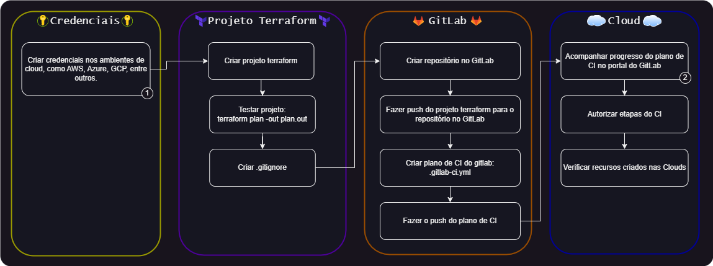
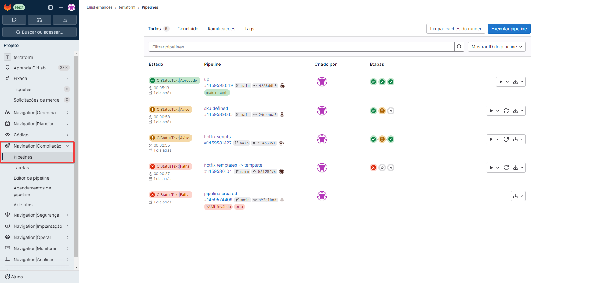

---
tags:
  - Terraform
  - Pipelines
  - GitLab
  - Azure
  - AWS
---

> Neste documento, vamos primeiro explorar brevemente o conceito de Terraform e, em seguida, entender o que é uma pipeline. Depois, combinaremos esses dois conceitos para criar um guia prático de implementação de pipelines, utilizando as ferramentas de CI do GitLab.

---

## Sumário

Antes de entrar em explicações detalhadas, vou apresentar um guia rápido das etapas. Se você já está familiarizado com as tecnologias e apenas precisa de uma visão geral para relembrar os passos necessários, este resumo será suficiente.



- **1** - [Seção Credenciais Cloud](#credenciais-cloud)
- **2** - [Acompanhar CI](#acompanhar-ci)

## O que é Terraform?

É uma ferramenta de Infraestrutura como Código (IaC), criada pela HashiCorp, que permite definir e provisionar infraestrutura em ambientes de nuvem (como AWS, Azure, GCP) ou em ambientes locais. Ele permite que toda a infraestrutura seja descrita como código, facilitando a automação, versionamento e gerenciamento de recursos.

- **Infraestrutura como Código (IaC):** A ideia de IaC é que a infraestrutura (servidores, redes, armazenamento, etc.) seja descrita em arquivos de código, e não configurada manualmente. Isso proporciona maior controle, automação e rastreabilidade.
- **HCL (HashiCorp Configuration Language):** O Terraform usa essa linguagem para descrever os recursos da infraestrutura de forma declarativa. Por exemplo, você define o estado desejado da infraestrutura, e o Terraform ajusta os recursos para coincidir com esse estado.

```hcl title="Exemplo - Criando uma instância EC2 na AWS"
provider "aws" {
  region = "us-east-1"
}

resource "aws_instance" "example" {
  ami           = "ami-123456"
  instance_type = "t2.micro"
}
```

## O que é Pipeline?

Um Pipeline é um conjunto de etapas ou processos automatizados que são executados em sequência, com o objetivo de integrar, testar e entregar software ou infraestrutura de forma eficiente e contínua.

- **Uso em CI/CD:** Nos ambientes de desenvolvimento e operações, pipelines são comumente usados em CI/CD (Integração Contínua e Entrega Contínua). Eles automatizam o processo de compilação, testes, validação e implantação de código, garantindo que o software seja entregue rapidamente e com qualidade.
- **Fases típicas:** Compilação, testes, deploy e monitoramento.
- **Ferramentas comuns:** Azure Pipelines, GitLab CI, Jenkins, GitHub Actions, CircleCI, TravisCI, dentre outros.

```yaml title="Exemplo - GitLab CI - Pipeline em três fases: build, test e deploy"
stages:
  - build
  - test
  - deploy

build:
  stage: build
  script:
    - echo "Building project..."

test:
  stage: test
  script:
    - echo "Running tests..."

deploy:
  stage: deploy
  script:
    - echo "Deploying project..."
```

## O que é Terraform Pipeline?

O Terraform Pipeline é a combinação do Terraform com os processos de um pipeline, resultando em um fluxo automatizado para gerenciar e provisionar infraestrutura de maneira consistente e eficiente.

Um Terraform Pipeline integra a execução do código Terraform dentro de um pipeline de CI/CD, automatizando as etapas necessárias para gerenciar a infraestrutura. Ele pode incluir fases como:

- Validação do código Terraform (terraform validate)
- Criação de um plano de execução (terraform plan) para mostrar as mudanças que serão aplicadas na infraestrutura
- Revisão e aprovação manual (opcional), onde o plano gerado pode ser revisado por administradores ou desenvolvedores antes de aplicar as mudanças
- Aplicação das mudanças (terraform apply), onde o código é executado e os recursos são provisionados ou modificados

**Benefícios do Terraform Pipeline:**

- _Automatização completa:_ Reduz a necessidade de intervenção manual e garante que a infraestrutura seja gerida de maneira automatizada e consistente.
- _Colaboração e rastreabilidade:_ Como o código é versionado e executado dentro de um pipeline, todas as mudanças ficam documentadas e revisáveis.
- _Escalabilidade e consistência:_ Permite que grandes equipes ou empresas gerenciem infraestruturas em várias nuvens e ambientes de maneira uniforme.

```yaml title="Exemplo - Pipeline Terraform com GitLab CI"
stages:
  - init
  - validate
  - plan
  - apply

variables:
  TF_VERSION: "1.4.6" # Versão do Terraform
  TF_WORKSPACE: "default" # Workspace que será utilizado

# Imagem do Docker com Terraform para executar os comandos
image: hashicorp/terraform:${TF_VERSION}

before_script:
  - terraform --version
  - terraform workspace select ${TF_WORKSPACE} || terraform workspace new ${TF_WORKSPACE}

cache:
  paths:
    - .terraform/

# Etapa de inicialização do Terraform
init:
  stage: init
  script:
    - terraform init

# Etapa de validação do código Terraform
validate:
  stage: validate
  script:
    - terraform validate

# Etapa de geração do plano Terraform
plan:
  stage: plan
  script:
    - terraform plan -out=tfplan
  artifacts:
    paths:
      - tfplan # Armazena o plano para ser aplicado posteriormente

# Etapa de aplicação do plano Terraform
apply:
  stage: apply
  when: manual # Define que a aplicação é manual para aprovação humana
  script:
    - terraform apply -auto-approve tfplan
```

## Implementação de pipelines

### Credenciais Cloud

Antes de iniciar a criação do pipeline, é necessário primeiro coletar as credenciais das plataformas de nuvem que serão utilizadas. Neste guia, utilizaremos o Azure e a AWS como exemplos.

#### AWS - Coletando credenciais para o terraform

No Terraform as credencias de acesso podem ser exportadas como variáveis de ambiente, principalmente em ambientes linux. Então para criar uma paridade de nomenclatura entre o Terraform e o Portal da AWS, estaremos indicando as credenciais com o mesmo nome de quando utilizado variaveis de ambiente. Dito isto, segue abaixo:

- AWS_ACCESS_KEY_ID
- AWS_SECRET_ACCESS_KEY

Partimos de que já tenha uma conta no AWS, com isso, faça o login com sua conta no portal do AWS.

1. AWS_ACCESS_KEY_ID
   - IAM > Usuários > Adicionar usuários > [Defina um nome] > Próximo > Anexar políticas diretamente > AdministratorAccess > Próximo > Criar usuário
   - [Clique no usuário criado] > Credenciais de segurança > Criar chave de acesso > Aplicação executada fora da AWS > Próximo > Criar chave de acesso
   - Copie "_Chave de acesso_"
2. AWS_SECRET_ACCESS_KEY
   - Copie "_Chave de acesso secreta_"

#### Azure - Coletando credenciais para o terraform

No Terraform as credencias de acesso podem ser exportadas como variáveis de ambiente, principalmente em ambientes linux. Então para criar uma paridade de nomenclatura entre o Terraform e o Portal do Azure, estaremos indicando as credenciais com o mesmo nome de quando utilizado variaveis de ambiente. Dito isto, segue abaixo:

- ARM_CLIENT_ID
- ARM_CLIENT_SECRET
- ARM_TENANT_ID
- ARM_SUBSCRIPTION_ID

Partimos de que já tenha uma conta no Azure, com isso, faça o login com sua conta no portal do Azure.

1. ARM_CLIENT_ID
   - Portal Azure > Microsoft Entra ID > Registros de Aplicativo > + Novo registro > [Define um nome] > Registrar
   - Copie "_ID do aplicativo (cliente)_"
2. ARM_TENANT_ID
   - Entre no registro criado na etapa "ARM_CLIENT_ID"
   - Copie o "_ID do diretório (locatário)_"
3. ARM_CLIENT_SECRET
   - Entre no registro criado na etapa "ARM_CLIENT_ID"
   - Adicionar um certificado ou segredo > + Novo segredo do cliente > [Defina uma descrição/nome] > Adicionar
   - Copie "_Valor_"
4. ARM_SUBSCRIPTION_ID
   - Assinaturas > [Selecione ou crie uma assinatura] > IAM (Controle de acesso) > Adicionar > Adicionar atribuição de função > Função > Funções de administrador priveligiadas
     - Contribuidor > Próximo
     - Selecionar Membros > [Nome do registro criado na etapa "ARM_CLIENT_ID"] > Selecionar > Próximo
     - Examinar + Atribuir
   - Assinaturas > [Selecione a sua assinatura] > Visão geral
   - copie "_ID da Assinatura_"

### Terraform pipeline com GitLab CI

Primeiro, faça o download deste [projeto pré-configurado do Terraform](https://drive.google.com/file/d/1Ouou60INwWpsBMWUGC87qJr3YJj0dt9v/view?usp=drive_link). O projeto está configurado para criar duas máquinas virtuais (VMs), uma na AWS e outra na Azure. No entanto, os arquivos estão ajustados para o meu ambiente, então será necessário realizar algumas modificações para que funcionem corretamente no seu. Como o foco agora é no pipeline, deixaremos as configurações detalhadas do Terraform para outro momento.

Agora, o arquivo disponibilizado no zip chamado **.gitlab-ci.yml** é responsável por automatizar o processo de execução do Terraform. Nele, descrevemos as etapas que serão seguidas no pipeline de CI. Assim, sempre que realizarmos um push no repositório do GitLab, o processo de integração contínua (CI) será disparado automaticamente, executando o Terraform e provisionando o ambiente conforme as configurações definidas.

**gitlab-ci.yml**

```yaml title="Configurações de CI do GitLab"
stages:
  - validate_plan
  - apply
  - destroy

.template:
  image:
    name: hashicorp/terraform:1.9
    entrypoint: [""]
  before_script:
    - terraform init

validate & plan:
  extends: .template
  stage: validate_plan
  script:
    - terraform validate
    - terraform refresh
    - terraform plan -out plan.out
  cache:
    key: plan
    policy: push
    paths:
      - plan.out

apply:
  extends: .template
  stage: apply
  script:
    - terraform apply plan.out
  cache:
    key: plan
    policy: pull
    paths:
      - plan.out
  when: manual

destroy:
  extends: .template
  stage: destroy
  script:
    - terraform destroy -auto-approve
  when: manual
```

Este arquivo está separado em três etapas, sendo:

- _Validate & plan_: Para testar as configurações do terraform e criar um plano de implementação
- _apply_: Aplica o plano de implementação, ou seja, cria as VMs
- _destroy_: Destroi tudo que foi criado na etapa anterior. Está configurado para autorização manual, ou seja, precisa acessar o portal do GitLab e autorizar essa etapa.

#### Acompanhar CI

Podemos acompanhar a execução da pipeline pelo portal do GitLab em Compilação > Pipelines, como identificado na imagem abaixo:



Na coluna "Etapas", estão identificadas as três fases que configuramos no arquivo **.gitlab-ci.yml**: _validate & plan_, _apply_ e _destroy_. Embora seja bastante intuitivo, é importante destacar o significado dos ícones de status: o símbolo vermelho indica uma falha que interrompe a execução do pipeline; o amarelo representa um alerta que deve ser avaliado, mas não impede o avanço do pipeline; o cinza indica que é necessária uma interação manual para prosseguir; e o verde confirma que tudo foi executado com sucesso.

Após a finalização da execução da etapa de apply do pipeline, pode verificar em sua nuvem que os recursos configurados no terraform já foram criados com sucesso.

## Finalização

Com isso conseguimos utilizar o Terraform num pipeline com o GitLab CI.

Estou muito feliz por ter você aqui! Se precisar de algo, não hesite em me contactar. 🌟
