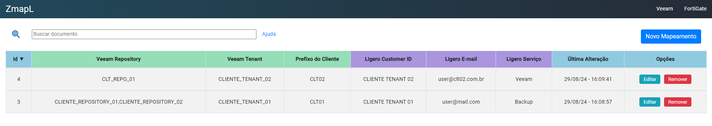

---
tags:
  - Zabbix
  - API
  - Angular
  - Node.js
  - OTRS
---

# **ZmapL**

Mapeando eventos de um mesmo host no Zabbix para abrir ticket com diferentes caracteristicas.

## **Motivação:**

Durante nosso trabalho recente com o Zabbix, identificamos a necessidade de que um mesmo host abra tickets automaticamente, mas com características distintas baseadas em seu nome. Essa necessidade surgiu devido ao nosso ambiente de Veeam, que gerencia jobs de vários clientes diferentes. Quando um chamado é gerado automaticamente, gostaríamos que ele fosse categorizado corretamente com o nome do cliente e o serviço apropriado.

## **Solução:**

Consideramos algumas abordagens, como segmentar os jobs em múltiplos hosts no Zabbix, com cada host dedicado a um cliente específico. No entanto, essa solução complicaria a organização e a inclusão de novos clientes. Assim, optamos por uma abordagem mais eficiente: utilizamos um arquivo JSON como um "DE/PARA" que mapeia o JOB com um prefixo e define as características que o chamado deve ter. Baseando-se nesse arquivo, a [automação que desenvolvemos em Python](https://kmpc2013.github.io/DocsLibrary/projetos/integrando_zabbix_com_otrs/) cria tickets automaticamente no nosso sistema de chamados. A automação identifica o evento de alerta de acordo com as características atribuídas pelo JSON e, em seguida, gera um ticket através da API do sistema de chamados. No entanto, é importante observar que manter e atualizar esse arquivo JSON, especialmente com várias pessoas envolvidas e quando clientes são adicionados, removidos ou modificados, pode ser suscetível a erros.

Para resolver esse problema, desenvolvemos uma aplicação web que facilita o gerenciamento desse arquivo. A solução foi criada usando **Angular** para o frontend, **Node.js** para o backend e **MySQL** para o banco de dados. Toda a infraestrutura está containerizada com **Docker** e pode ser visualizada nos links abaixo:

- <a href="https://github.com/kmpc2013/ZmapL" target="_blank">Projeto no GitHub</a>
- <a href="https://hub.docker.com/repository/docker/kmpc2013/zmaplfront/general" target="_blank">Container Frontend</a>
- <a href="https://hub.docker.com/repository/docker/kmpc2013/zmaplback/general" target="_blank">Container Backend</a>

## **Benefícios:**

Com essa solução, qualquer usuário pode acessar o portal, chamado ZmapL (abreviação de Zabbix Map to Ligero), para realizar as ações necessárias. Isso traz mais facilidade, agilidade e reduz significativamente a incidência de erros.